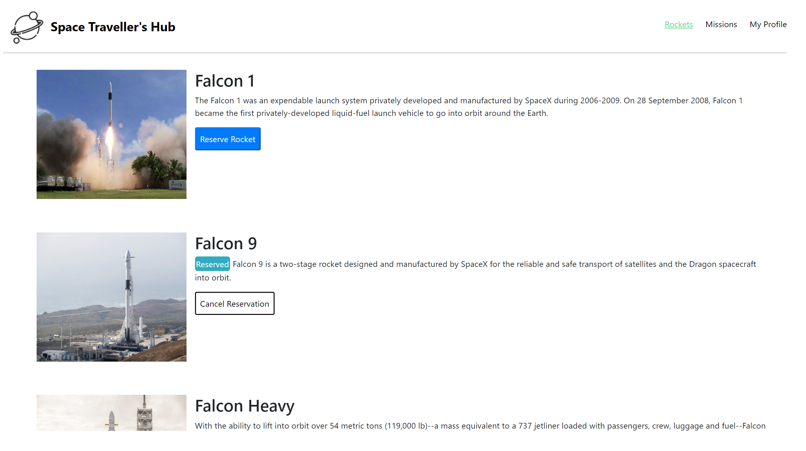

<a name="readme-top"></a>

<div align="center">
  <!-- You are encouraged to replace this logo with your own! Otherwise you can also remove it. -->
  
  <br/>

  <h3><b>Microverse README Template</b></h3>

</div>

<!-- TABLE OF CONTENTS -->

# 📗 Table of Contents

<details>
  <summary>📗 Table of Contents</summary>
  <ul>
    <li><a href="#-about-project-">📖 Space Travelers Hub</a></li>
    <li><a href="#-built-with-">🛠 Built With</a></li>
    <li><a href="#-live-demo-">🚀 Live Demo </a></li>
    <li><a href="#-getting-started-">💻 Getting Started</a></li>
    <li><a href="#-authors-">👥 Authors </a></li>
    <li><a href="#-future-features-">🔭 Future Features</a></li>
    <li><a href="#-contributing-">🤝 Contributing</a></li>
    <li><a href="#️-show-your-support-">⭐️ Show your support </a></li>
    <li><a href="#-acknowledgments-">🙏 Acknowledgments </a></li>
    <li><a href="#-license-">📝 License</a></li>
  </ul>
</details>

<br>

<!-- PROJECT DESCRIPTION -->

# 📖 Space Travellers <a name="about-project"></a>

> Space Travellers is a website for a company that provides commercial and scientific space travel services. The application allow users to book rockets and join selected space missions.

## 🛠 Built With <a name="built-with"></a>

### Tech Stack <a name="tech-stack"></a>

> Describe the tech stack and include only the relevant sections that apply to your project.

<details>
  <summary>Client</summary>
  <ul>
    <li><a href="https://reactjs.org/">React.js</a></li>
    <li><a href="https://redux.js.org/">Redux</a></li>
    <li><a href="https://getbootstrap.com/">Bootstrap</a></li>
  </ul>
</details>

<details>
  <summary>Server</summary>
  <ul>
    <li><a href="https://render.com/">Render</a></li>
  </ul>
</details>

<!-- Features -->

### Key Features <a name="key-features"></a>

- **React Components**
- **Redux Store**
- **Jest Tests**
- **Bootstrap**

<p align="right">(<a href="#readme-top">back to top</a>)</p>

<!-- LIVE DEMO -->

## 🚀 Live Demo <a name="live-demo"></a>

- [Live Demo Link](https://space-travellers-rockets-and-missions.onrender.com)



<p align="right">(<a href="#readme-top">back to top</a>)</p>

<!-- GETTING STARTED -->

## 💻 Getting Started <a name="getting-started"></a>

To get a local copy up and running, follow these steps.

### Prerequisites

In order to run this project you need:

```sh
 git
 npm
 node
 Your favorite text editor
```

### Setup

Clone this repository to your desired folder:

```sh
  git clone https://github.com/Shisui6/space-travelers-hub.git
```

### Install

Install this project with:

```sh
  cd space-travelers-hub
  npm install
```

### Usage

To run the project, execute the following command:

```sh
  npm run build - Builds development files into production code
  npm start - Starts the development server
```

### Run tests

> To run tests, run the following commands:

```sh
- npx run test
```

### Run Linters

- npx eslint .
- npx stylelint "\*_/_.{css,scss}"

<p align="right">(<a href="#readme-top">back to top</a>)</p>

<!-- AUTHORS -->

## 👥 Authors <a name="authors"></a>

> Mention all of the collaborators of this project.

👤 **Author1**

- GitHub: [@mkaya13](https://github.com/githubhandle)
- Twitter: [@mkaya133](https://twitter.com/twitterhandle)
- LinkedIn: [LinkedIn](https://www.linkedin.com/in/mert-kaya-0732b717b/)

👤 **Author2**

- GitHub: [@ginabeki](http://github.com/ginabeki)
- Twitter: [@\_gina_bw](https://twitter.com/_gina_bw)
- LinkedIn: [LinkedIn](https://www.linkedin.com/in/gina-beki-a85846103/)

<p align="right">(<a href="#readme-top">back to top</a>)</p>

<!-- FUTURE FEATURES -->

## 🔭 Future Features <a name="future-features"></a>

- [ ] **APIS**
- [ ] **Extra Components**
- [ ] **Authenticate**
- [ ] **Local Storage**

<p align="right">(<a href="#readme-top">back to top</a>)</p>

<!-- CONTRIBUTING -->

## 🤝 Contributing <a name="contributing"></a>

Contributions, issues, and feature requests are welcome!

Feel free to check the [issues page](https://github.com/ginabeki/space-travellers/issues).

<p align="right">(<a href="#readme-top">back to top</a>)</p>

<!-- SUPPORT -->

## ⭐️ Show your support <a name="support"></a>

> Write a message to encourage readers to support your project

If you like this project...

<p align="right">(<a href="#readme-top">back to top</a>)</p>

<!-- ACKNOWLEDGEMENTS -->

## 🙏 Acknowledgments <a name="acknowledgements"></a>

> Give credit to everyone who inspired your codebase.

I would like to thank...

<p align="right">(<a href="#readme-top">back to top</a>)</p>

<!-- FAQ (optional) -->

## ❓ FAQ <a name="faq"></a>

> Add at least 2 questions new developers would ask when they decide to use your project.

- **[How do you set up react?]**

  - [You run `npx create-react-app <project-name>`]

- **[How to run the project after cloning]**

  - `npm install`
  - `npm run start`

<p align="right">(<a href="#readme-top">back to top</a>)</p>

<!-- LICENSE -->

## 📝 License <a name="license"></a>

This project is [MIT](./MIT.md) licensed.

_NOTE: we recommend using the [MIT license](https://choosealicense.com/licenses/mit/) - you can set it up quickly by [using templates available on GitHub](https://docs.github.com/en/communities/setting-up-your-project-for-healthy-contributions/adding-a-license-to-a-repository). You can also use [any other license](https://choosealicense.com/licenses/) if you wish._

<p align="right">(<a href="#readme-top">back to top</a>)</p>
